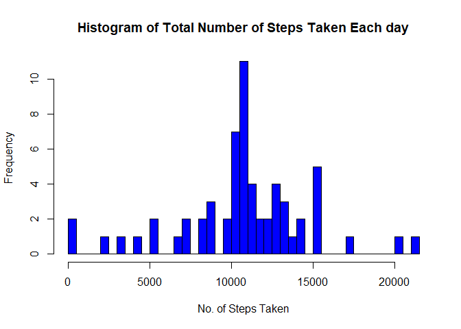

Introduction
------------

This R Markdown document has been created for COursera's "Reproducible
Research" course for the first Peer Graded Assignment

The data is based on a personal montoring device from an anonymous
individual collected over a 2 month time period. Following is the
description of the data that has been provided:

The variables included in this dataset are:

1.  steps: Number of steps taking in a 5-minute interval (missing values
    are coded as NA)
2.  date: The date on which the measurement was taken in YYYY-MM-DD
    format
3.  interval: Identifier for the 5-minute interval in which measurement
    was taken

Using the data this R Markdown file shows the steps taken in completing
the analysis as requested by the assignment

Loading and preprocessing the data
----------------------------------

-   Data is loaded using the working directory where data is saved.
-   Removal of NAs from the steps column is done
-   Summary of the data is obtained

<!-- -->

    setwd("C:/Users/talha/Downloads/5-Reproducible Research/Week2/repdata_data_activity")
    df<-read.csv("activity.csv", colClasses = c("numeric","Date","numeric"))
    df2<-df[!(is.na(df$steps)),]
    head(df2)

    ##     steps       date interval
    ## 289     0 2012-10-02        0
    ## 290     0 2012-10-02        5
    ## 291     0 2012-10-02       10
    ## 292     0 2012-10-02       15
    ## 293     0 2012-10-02       20
    ## 294     0 2012-10-02       25

    str(df2)

    ## 'data.frame':    15264 obs. of  3 variables:
    ##  $ steps   : num  0 0 0 0 0 0 0 0 0 0 ...
    ##  $ date    : Date, format: "2012-10-02" "2012-10-02" ...
    ##  $ interval: num  0 5 10 15 20 25 30 35 40 45 ...

What is mean total number of steps taken per day?
-------------------------------------------------

Assignment Questions - Section 1
--------------------------------

**Q1 Calculate the total number of steps taken per day**

    sum_steps<-aggregate(steps~date,df2,sum)
    head(sum_steps)

    ##         date steps
    ## 1 2012-10-02   126
    ## 2 2012-10-03 11352
    ## 3 2012-10-04 12116
    ## 4 2012-10-05 13294
    ## 5 2012-10-06 15420
    ## 6 2012-10-07 11015

**Q2 Make a histogram of the total number of steps taken each day**

    hist(sum_steps$steps, col = "blue", xlab = "No. of Steps Taken", main = "Histogram of Total Number of Steps Taken Each day")

**Q3 Calculate and report the mean and median of the total number of
steps taken per day**

    steps_mean<-mean(sum_steps$steps)
    steps_median<-median(sum_steps$steps)

Mean value calculated is ***10766.19***, and the Median value
***10765***

What is the average daily activity pattern?
-------------------------------------------

Assignment Questions - Section 2
--------------------------------

**Q1 Make a time series plot (i.e. type="1") of the 5-minute interval
(x-axis) and the average number of steps taken, averaged across all days
(y-axis)**

    avg_daily_pattern<-aggregate(steps~interval,df2,mean)
    plot(x=avg_daily_pattern$interval,y=avg_daily_pattern$steps, type = "l",main = "Time series of Average Steps Per Interval Across all Days", ylab = "No. of Steps", xlab = "5 Min Intervals")

**Q2 Which 5-minute interval, on average across all the days in the
dataset, contains the maximum number of steps?**

The 5 minute interval which has the maximum number of steps across all
intervals is ***835***

Imputing missing values
-----------------------

Assignment Questions - Section 3
--------------------------------

**Q1 Calculate and report the total number of missing values in the
dataset (i.e. the total number of rows with NAs)**

The total number of NAs across all 3 columns in the data set are
calculated below:

    sum(is.na(df$steps))+ sum(is.na(df$interval))+ sum(is.na(df$date))

    ## [1] 2304

Therefore we can see that 2304 rows have NAs, all of them in the Steps
Variable

**Q2 Devise a strategy for filling in all of the missing values in the
dataset**

To impute the mean I use the mean of the 5 minute interval for the
corresponding NA value to create a new dataframe called r

**Q3 Create a new dataset that is equal to the original dataset but with
the missing data filled in.**

-   To achieve this I create a copy of the orginial data set called df3
-   I then merge df3 with the average daily pattern dataset conditioned
    on the intervals. This data set is called r
-   I then use a conditional statement where if a NA value is detected
    in steps the average from the corresponding interval value is
    replaced

<!-- -->

    df3<-df
    r = merge(df3, avg_daily_pattern, by="interval", suffixes=c(".df3", ".avg_daily_pattern"))
    r$steps = ifelse(is.na(r$steps.df3), r$steps.avg_daily_pattern, r$steps.df3)
    r$steps.df3<-NULL
    r$steps.avg_daily_pattern<-NULL

**Q4 Make a histogram of the total number of steps taken each day and
Calculate and report the mean and median total number of steps taken per
day.**

I do the following calculations to prepare the data for the new
histogram and calculations with the imputed data

    sum_steps2<-aggregate(steps~date,r,sum)
    mean_2<-mean(sum_steps2$steps)
    Median_2<-median(sum_steps2$steps)
    hist(sum_steps2$steps, col = "blue", xlab = "No. of Steps Taken", main = "Histogram of Total Number of Steps Taken Each day")

The mean of the imputed dataset is **10766.19** and the median is
**10766.19**. Imputing the data using the technique I have used has
resulted in both the mean and median of the imputed data equalling the
mean of the non-imputed data

Are there differences in activity patterns between weekdays and weekends?
-------------------------------------------------------------------------

Assignment Questions - Section 4
--------------------------------

**Q1 Create a new factor variable in the dataset with two levels -
"weekday" and "weekend" indicating whether a given date is a weekday or
weekend day.**

I created a new copy of the imputed data called *imputeddata*. Then I
created another column for days of the week and whwther its a weekend or
not. The code is given below

    imputeddata<-r
    imputeddata$days<-as.factor(weekdays(imputeddata$date))
    imputeddata$days2<-as.factor(weekdays(imputeddata$date))
    levels(imputeddata$days)[levels(imputeddata$days) == "Saturday"] <- "Weekend"
    levels(imputeddata$days)[levels(imputeddata$days) == "Sunday"] <- "Weekend"
    levels(imputeddata$days)[levels(imputeddata$days) == "Monday"] <- "Weekday"
    levels(imputeddata$days)[levels(imputeddata$days) == "Tuesday"] <- "Weekday"
    levels(imputeddata$days)[levels(imputeddata$days) == "Wednesday"] <- "Weekday"
    levels(imputeddata$days)[levels(imputeddata$days) == "Thursday"] <- "Weekday"
    levels(imputeddata$days)[levels(imputeddata$days) == "Friday"] <- "Weekday"

**Q2 Make a panel plot containing a time series plot (i.e. type="l") of
the 5-minute interval (x-axis) and the average number of steps taken,
averaged across all weekday days or weekend days (y-axis)**

Following is the code to create the plots for the weekday and weekend
graphs for average number of steps taken in 5 minute intervals across
all weekdays or weekends

    weekday_data<-imputeddata[imputeddata$days=="Weekday",]
    weekend_data<-imputeddata[imputeddata$days=="Weekend",]
    mean_weekday<-aggregate(steps~interval,weekday_data,mean)   
    mean_weekend<-aggregate(steps~interval,weekend_data,mean) 
    par(mfrow=c(2, 1), mar=c(4, 4.1, 3, 2.1))
    plot(mean_weekday$interval, mean_weekday$steps, type="l",
         main="Time Series Plot of Average Steps Taken per 5min Interval for Weekdays",
         xlab="Intervals (in 5 mins)", ylab="Number of Steps", col="red", lwd=1.5, ylim=c(0, 250))
    plot(mean_weekend$interval, mean_weekend$steps, type="l",
         main="Time Series Plot of Average Steps Taken per 5min Interval for Weekends",
         xlab="Intervals (in 5 mins)", ylab="Number of Steps", col="blue", lwd=1.5, ylim=c(0, 250))

Based on the plots there seem to be differences bwtween the activity
patters of weekdays and weekends with activity being highest at 8-9 AM
on Weekdays but activity on weekends is regularly high thorughout the
active day
